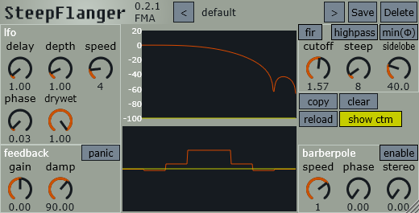

# steep flanger

steep flanger 是一个 FIR/IIR 镶边（flanger）插件。

## 功能

FIR 镶边  
IIR 镶边  
barberpole 镶边  

## 界面

## 演示

[bilibili](https://www.bilibili.com/video/BV198npzXEPn)  
[youtube](https://www.youtube.com/watch?v=yQ357S2LP2w)  

## 信号流

### FIR 部分 ###

### IIR 部分 ###

TODO
