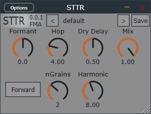

# sttr
sttr基于[CCRMA的工作](https://ccrma.stanford.edu/~hskim08/sttr/index.html)，结合我的其他实验结果而来  
它是一个粒子效果器，但固定了许多粒子参数不让调整  
基本来说，它会在原有频谱上产生其他的谐波，这些谐波频率由Hop控制，振幅由窗函数控制  
通过反向/正向播放，额外的谐波频率会与原始频率反向/正向移动，类似piwarp/环形调制器  

## features
短时时间反向（或不反向）  
简单的共振峰移动（在短hop下表现为共振峰移动，在长hop则像音高移动）  
更灵活的窗函数塑造频谱  
