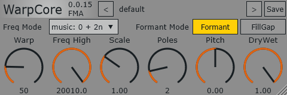

# WarpCore

尝试重现 Prosoniq PiWarp 或 Zynaptiq Wormhole 插件的效果。  
This project attempts to recreate the effect style of Prosoniq PiWarp or Zynaptiq Wormhole.

WarpCore 是一个`多段频谱反转`插件，类似于 PiWarp/Wormhole 的`时域局部频谱反转`效果。  
WarpCore is a `multi-band spectrum inversion` plugin, similar to the `time-domain local spectrum inversion` effect of PiWarp/Wormhole.

如果你想了解如何做到反转频谱，这里是我参考的资源。  
If you want to know how to reverse the spectrum, here are the resources I referred to.  
[Spectral Flipping Around Signal Center Frequency](https://dsprelated.com/showarticle/37.php)

> [!WARNING]
> These demo videos are old version which has a bad quality on complex source like music signal.  
> 这些演示视频是旧版本，在复杂的音乐信号上质量很差。  
[YouTube](https://www.youtube.com/watch?v=7CM1Xm0MM6E)  
[Bilibili](https://www.bilibili.com/video/BV1UVAkzsEvP)

[Bilibili New version Demo](https://www.bilibili.com/video/BV1WfwRzEEjK)  
[Bilibili WarpCore destroy the whole song](https://www.bilibili.com/video/BV1tpA5zyEo2)  

## 功能(Features)

动态 SIMD 调度以充分利用您的现代 CPU。  
dynamic simd dispatch to fully use your modern cpu.  
零延迟，只有来自巴特沃斯滤波器的非线性相位。  
zero latency with some nonlinear phase from butterworth filter.  

- [x] 可配置极点数滤波器  
  Configurable filter pole count.

  包括：滤波器极点数量、滤波器截止频率缩放。  
  Includes: filter pole count and filter cutoff frequency scaling.

- [x] 共振峰移动  
  Formant shifting.

  应该是加在输出的振荡器上面。  
  This should be applied on the output oscillator stage.

- [x] 参数平滑  
  parameter smooth.

## 图形界面(GUI)

> [!TIP]
> if you want a close preset to **default Piwarp**, set paramter  
> 如果你想要一个接近默认Piwarp的预设，设置参数为  
> **Warp** = 50  
> **Freq High** = Full  
> **Scale** = 1.0  
> **Poles** = 3  
> **Pitch** = 0  
> **DryWet** = 1  
> **Freq Mode** = music: 0 + 2n  

## GUI使用(GUI usage)
对旋钮右键应该弹出一个菜单，使用**enter**输入想要的数值，使用**reset**重置到默认值。  
Right-clicking on the knob should bring up a menu, use **enter** to input the desired value, and use **reset** to reset to the default value.  
双击旋钮也会重置到默认值。  
Double-clicking the knob will also reset it to the default value.  
> [!TIP]
> FreqHigh=Full时频段范围会随着采样率变化，如果想要在所有采样率保持，请使用FreqHigh=19999.2（通过enter输入19999得到）  
> When FreqHigh=Full, the frequency band range changes with the sampling rate. If you want it to stay the same for all sampling rates, please use FreqHigh=19999.2 (obtained by entering 19999).  

## 参数(Parameter)

It seems that many people cannot understand the parameters of WarpCore, so here is an additional explanation:  
似乎很多人不能理解WarpCore的参数，在这里增加说明  

| 参数 (Parameter) | English Description | 中文说明 |
| :--- | :--- | :--- |
| **Warp** | Divides the spectrum from 0 to FreqHigh into this number of segments and applies spectral inversion separately to each segment. | 将 0 ~ FreqHigh 的频谱分割为该参数指定的段数，对每个段分别进行光谱反转。 |
| **Freq High** | Sets the highest frequency for the inverted spectrum; audio above this frequency will be filtered out (silenced). | 设置反转频谱的最高频率，超过此频率的音频将会被过滤（静音）。 |
| **Scale** | Controls the cutoff frequency of the filter in the inversion device. < 1: comb filter/resonator effects; > 1: segment overlap/rougher texture. | 控制每个频段反转装置中滤波器的截止频率。小于 1 会产生类似梳状滤波（谐振器）的效果；大于 1 会导致段间重叠，质感更粗糙。 |
| **Poles** | Controls the order of the filter (best between 2-4). Lower: rough texture; Higher: less overlap but enhanced metallic feel. | 控制滤波器阶数（建议设为 2~4）。数值较低质感粗糙，数值较高则段间重叠减少，但会增加微弱的金属感。 |
| **Pitch** | FormantMode=Pitch: controls output pitch. FormantMode=Formant: shifts formants without changing pitch. | 在 Pitch 模式下控制输出音高；在 Formant 模式下移动共振峰而不改变音高。 |
| **Dry/Wet** | Mixes dry and inverted wet signals. Nonlinear phase may cause notch filtering or peculiar phase cancellations. | 混合干声与反转湿声。由于滤波器的非线性相位，可能会产生陷波或奇特的相位抵消。 |
| **Formant Mode** | Controls whether pitch affects the pre-oscillator or the post-oscillator (see **Pitch** explanation). | 控制 Pitch 作用于前振荡器还是后振荡器，具体效果参考 **Pitch** 参数说明。 |
| **Freq Mode** | Controls oscillator frequency distribution. 0+xn: skips 1st segment inversion; 1+xn: inverts 1st segment (x+n equiv. to Scale*2 compare to x+2n). | 控制振荡器频率分布。0+xn 基本不反转第一个频段，而 1+xn 会。x+n 在某种程度上等同于将 Scale 翻倍。 |
| **FillGap** | Controls filter scale follow **pitch** parameter. create combfilter or bands overlay. | 控制滤波器频率缩放是否跟随**pitch**参数，这会导致梳妆滤波或者重叠的频率段。 |
