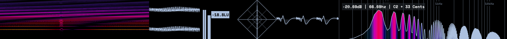

# deep phaser
deep phaser is a FIR phaser plugin.  
it is the son of steep-flanger and dispersive-delay.  
it can generate effects sounds like harmor phaser.  

> [!WARNNING]  
> massive cpu consume for calculating allpass filters.  

## features
FIR phaser  
barberpole phasing  

## gui

## demo

## todo
-[ ] optimise  
-[ ] add allpass filter blend modulation lfo  
-[ ] avx simd version and dynamic dispatch  