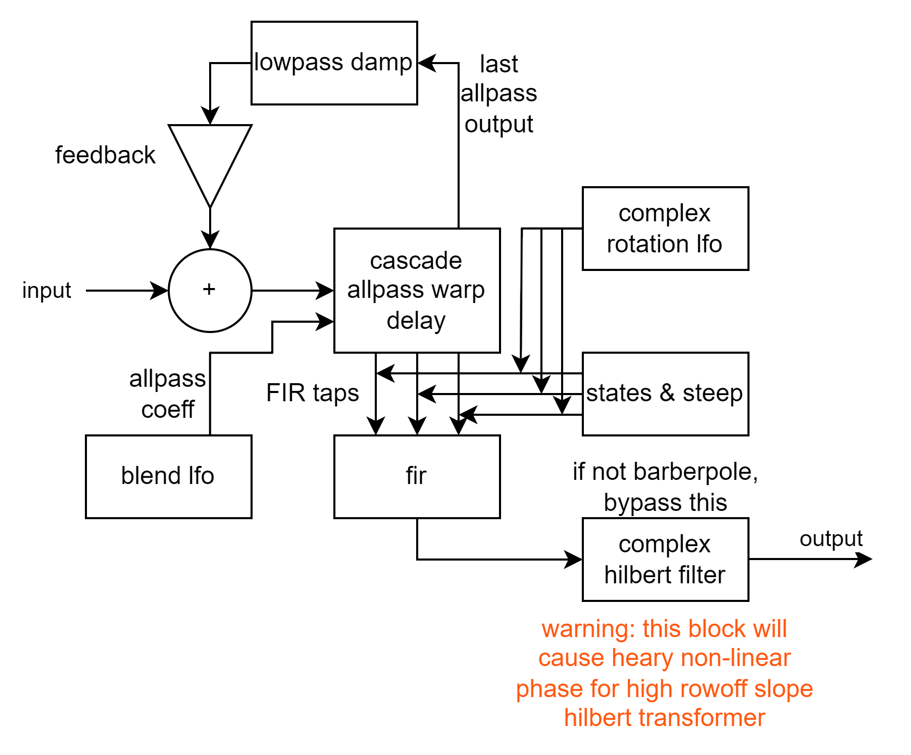

# deep phaser
deep phaser is a FIR phaser plugin.  
it is an approximately log-warp style of steep-flanger to create phaser-sounding notches.  
it can generate effects sounds like [harmor](https://www.image-line.com/fl-studio-learning/fl-studio-online-manual/html/plugins/Harmor.htm) phaser or even more resonating phaser sound.  

> [!WARNING]  
> massive cpu consume for calculating allpass filters.  

## signal-flow

## features
FIR phaser  
barberpole phasing  

## gui

## demo
[bilibili](https://www.bilibili.com/video/BV1rBWyzBEQs)  
[youtube](https://www.youtube.com/watch?v=-OuCLQlKYQk)  

## todo
-[ ] optimise  
-[ ] add allpass filter blend modulation lfo  
-[ ] avx simd version and dynamic dispatch  