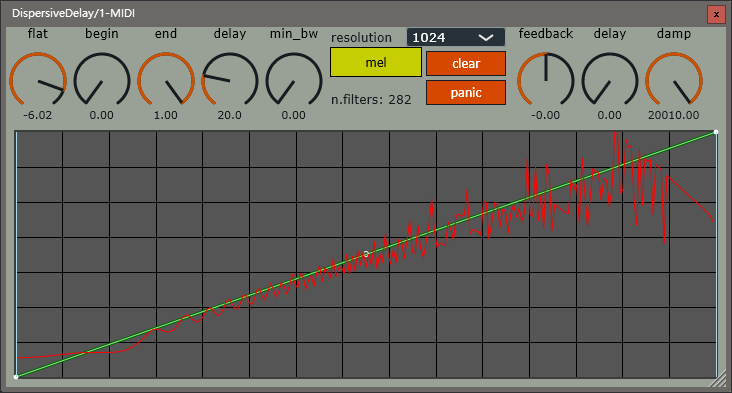

# dispersive-delay

dispersive-delay is the rework version of [sdelay](https://github.com/a5632645/sdelay)

> [!NOTE]  
> This plugin requires AVX or AVX2 support.  

> [!WARNING]  
> massive cpu consume when too much filters.  

## signal-flow

<svg xmlns="http://www.w3.org/2000/svg" xmlns:xlink="http://www.w3.org/1999/xlink" version="1.1" width="490px" viewBox="-0.5 -0.5 490 121" content="&lt;mxfile host=&quot;Electron&quot; modified=&quot;2025-10-18T04:12:39.883Z&quot; agent=&quot;Mozilla/5.0 (Windows NT 10.0; Win64; x64) AppleWebKit/537.36 (KHTML, like Gecko) draw.io/22.1.2 Chrome/114.0.5735.289 Electron/25.9.4 Safari/537.36&quot; etag=&quot;b7Ke8T40anl6_5V4kKnN&quot; version=&quot;22.1.2&quot; type=&quot;device&quot;&gt;&#10;  &lt;diagram name=&quot;第 1 页&quot; id=&quot;V9qob2rwjMBJSb1sBFDI&quot;&gt;&#10;    &lt;mxGraphModel dx=&quot;1390&quot; dy=&quot;383&quot; grid=&quot;1&quot; gridSize=&quot;10&quot; guides=&quot;1&quot; tooltips=&quot;1&quot; connect=&quot;1&quot; arrows=&quot;1&quot; fold=&quot;1&quot; page=&quot;1&quot; pageScale=&quot;1&quot; pageWidth=&quot;827&quot; pageHeight=&quot;1169&quot; math=&quot;0&quot; shadow=&quot;0&quot;&gt;&#10;      &lt;root&gt;&#10;        &lt;mxCell id=&quot;0&quot; /&gt;&#10;        &lt;mxCell id=&quot;1&quot; parent=&quot;0&quot; /&gt;&#10;        &lt;mxCell id=&quot;vh8--_7yuRtIzIg0JLTh-9&quot; style=&quot;edgeStyle=orthogonalEdgeStyle;rounded=0;orthogonalLoop=1;jettySize=auto;html=1;entryX=1;entryY=0.5;entryDx=0;entryDy=0;&quot; edge=&quot;1&quot; parent=&quot;1&quot; source=&quot;vh8--_7yuRtIzIg0JLTh-1&quot; target=&quot;vh8--_7yuRtIzIg0JLTh-4&quot;&gt;&#10;          &lt;mxGeometry relative=&quot;1&quot; as=&quot;geometry&quot; /&gt;&#10;        &lt;/mxCell&gt;&#10;        &lt;mxCell id=&quot;vh8--_7yuRtIzIg0JLTh-1&quot; value=&quot;cascade allpass filters&quot; style=&quot;rounded=0;whiteSpace=wrap;html=1;&quot; vertex=&quot;1&quot; parent=&quot;1&quot;&gt;&#10;          &lt;mxGeometry x=&quot;160&quot; y=&quot;240&quot; width=&quot;80&quot; height=&quot;40&quot; as=&quot;geometry&quot; /&gt;&#10;        &lt;/mxCell&gt;&#10;        &lt;mxCell id=&quot;vh8--_7yuRtIzIg0JLTh-7&quot; style=&quot;edgeStyle=orthogonalEdgeStyle;rounded=0;orthogonalLoop=1;jettySize=auto;html=1;entryX=0;entryY=0.5;entryDx=0;entryDy=0;&quot; edge=&quot;1&quot; parent=&quot;1&quot; source=&quot;vh8--_7yuRtIzIg0JLTh-2&quot; target=&quot;vh8--_7yuRtIzIg0JLTh-1&quot;&gt;&#10;          &lt;mxGeometry relative=&quot;1&quot; as=&quot;geometry&quot; /&gt;&#10;        &lt;/mxCell&gt;&#10;        &lt;mxCell id=&quot;vh8--_7yuRtIzIg0JLTh-2&quot; value=&quot;+&quot; style=&quot;ellipse;whiteSpace=wrap;html=1;aspect=fixed;&quot; vertex=&quot;1&quot; parent=&quot;1&quot;&gt;&#10;          &lt;mxGeometry x=&quot;80&quot; y=&quot;240&quot; width=&quot;40&quot; height=&quot;40&quot; as=&quot;geometry&quot; /&gt;&#10;        &lt;/mxCell&gt;&#10;        &lt;mxCell id=&quot;vh8--_7yuRtIzIg0JLTh-11&quot; style=&quot;edgeStyle=orthogonalEdgeStyle;rounded=0;orthogonalLoop=1;jettySize=auto;html=1;entryX=1;entryY=0.5;entryDx=0;entryDy=0;&quot; edge=&quot;1&quot; parent=&quot;1&quot; source=&quot;vh8--_7yuRtIzIg0JLTh-4&quot; target=&quot;vh8--_7yuRtIzIg0JLTh-5&quot;&gt;&#10;          &lt;mxGeometry relative=&quot;1&quot; as=&quot;geometry&quot; /&gt;&#10;        &lt;/mxCell&gt;&#10;        &lt;mxCell id=&quot;vh8--_7yuRtIzIg0JLTh-4&quot; value=&quot;damp lowpass&quot; style=&quot;rounded=0;whiteSpace=wrap;html=1;&quot; vertex=&quot;1&quot; parent=&quot;1&quot;&gt;&#10;          &lt;mxGeometry x=&quot;280&quot; y=&quot;160&quot; width=&quot;80&quot; height=&quot;40&quot; as=&quot;geometry&quot; /&gt;&#10;        &lt;/mxCell&gt;&#10;        &lt;mxCell id=&quot;vh8--_7yuRtIzIg0JLTh-6&quot; style=&quot;edgeStyle=orthogonalEdgeStyle;rounded=0;orthogonalLoop=1;jettySize=auto;html=1;entryX=0.5;entryY=0;entryDx=0;entryDy=0;&quot; edge=&quot;1&quot; parent=&quot;1&quot; source=&quot;vh8--_7yuRtIzIg0JLTh-5&quot; target=&quot;vh8--_7yuRtIzIg0JLTh-2&quot;&gt;&#10;          &lt;mxGeometry relative=&quot;1&quot; as=&quot;geometry&quot; /&gt;&#10;        &lt;/mxCell&gt;&#10;        &lt;mxCell id=&quot;vh8--_7yuRtIzIg0JLTh-5&quot; value=&quot;delayline&quot; style=&quot;rounded=0;whiteSpace=wrap;html=1;&quot; vertex=&quot;1&quot; parent=&quot;1&quot;&gt;&#10;          &lt;mxGeometry x=&quot;160&quot; y=&quot;160&quot; width=&quot;80&quot; height=&quot;40&quot; as=&quot;geometry&quot; /&gt;&#10;        &lt;/mxCell&gt;&#10;        &lt;mxCell id=&quot;vh8--_7yuRtIzIg0JLTh-10&quot; value=&quot;&quot; style=&quot;endArrow=classic;html=1;rounded=0;&quot; edge=&quot;1&quot; parent=&quot;1&quot;&gt;&#10;          &lt;mxGeometry width=&quot;50&quot; height=&quot;50&quot; relative=&quot;1&quot; as=&quot;geometry&quot;&gt;&#10;            &lt;mxPoint x=&quot;380&quot; y=&quot;260&quot; as=&quot;sourcePoint&quot; /&gt;&#10;            &lt;mxPoint x=&quot;429.3333333333333&quot; y=&quot;260&quot; as=&quot;targetPoint&quot; /&gt;&#10;          &lt;/mxGeometry&gt;&#10;        &lt;/mxCell&gt;&#10;        &lt;mxCell id=&quot;vh8--_7yuRtIzIg0JLTh-12&quot; value=&quot;&quot; style=&quot;endArrow=classic;html=1;rounded=0;&quot; edge=&quot;1&quot; parent=&quot;1&quot;&gt;&#10;          &lt;mxGeometry width=&quot;50&quot; height=&quot;50&quot; relative=&quot;1&quot; as=&quot;geometry&quot;&gt;&#10;            &lt;mxPoint x=&quot;40&quot; y=&quot;260&quot; as=&quot;sourcePoint&quot; /&gt;&#10;            &lt;mxPoint x=&quot;80&quot; y=&quot;260&quot; as=&quot;targetPoint&quot; /&gt;&#10;          &lt;/mxGeometry&gt;&#10;        &lt;/mxCell&gt;&#10;        &lt;mxCell id=&quot;vh8--_7yuRtIzIg0JLTh-13&quot; value=&quot;input&quot; style=&quot;text;html=1;strokeColor=none;fillColor=none;align=center;verticalAlign=middle;whiteSpace=wrap;rounded=0;&quot; vertex=&quot;1&quot; parent=&quot;1&quot;&gt;&#10;          &lt;mxGeometry x=&quot;-10&quot; y=&quot;245&quot; width=&quot;60&quot; height=&quot;30&quot; as=&quot;geometry&quot; /&gt;&#10;        &lt;/mxCell&gt;&#10;        &lt;mxCell id=&quot;vh8--_7yuRtIzIg0JLTh-14&quot; value=&quot;output&quot; style=&quot;text;html=1;strokeColor=none;fillColor=none;align=center;verticalAlign=middle;whiteSpace=wrap;rounded=0;&quot; vertex=&quot;1&quot; parent=&quot;1&quot;&gt;&#10;          &lt;mxGeometry x=&quot;420&quot; y=&quot;245&quot; width=&quot;60&quot; height=&quot;30&quot; as=&quot;geometry&quot; /&gt;&#10;        &lt;/mxCell&gt;&#10;      &lt;/root&gt;&#10;    &lt;/mxGraphModel&gt;&#10;  &lt;/diagram&gt;&#10;&lt;/mxfile&gt;&#10;" onclick="(function(svg){var src=window.event.target||window.event.srcElement;while (src!=null&amp;&amp;src.nodeName.toLowerCase()!='a'){src=src.parentNode;}if(src==null){if(svg.wnd!=null&amp;&amp;!svg.wnd.closed){svg.wnd.focus();}else{var r=function(evt){if(evt.data=='ready'&amp;&amp;evt.source==svg.wnd){svg.wnd.postMessage(decodeURIComponent(svg.getAttribute('content')),'*');window.removeEventListener('message',r);}};window.addEventListener('message',r);svg.wnd=window.open('https://viewer.diagrams.net/?client=1&amp;page=0&amp;edit=_blank');}}})(this);" style="cursor:pointer;max-width:100%;max-height:121px;"><defs/><g><path d="M 250 100 L 390 100 L 390 20 L 376.37 20" fill="none" stroke="rgb(0, 0, 0)" stroke-miterlimit="10" pointer-events="stroke"/><path d="M 371.12 20 L 378.12 16.5 L 376.37 20 L 378.12 23.5 Z" fill="rgb(0, 0, 0)" stroke="rgb(0, 0, 0)" stroke-miterlimit="10" pointer-events="all"/><rect x="170" y="80" width="80" height="40" fill="rgb(255, 255, 255)" stroke="rgb(0, 0, 0)" pointer-events="all"/><g transform="translate(-0.5 -0.5)"><switch><foreignObject pointer-events="none" width="100%" height="100%" requiredFeatures="http://www.w3.org/TR/SVG11/feature#Extensibility" style="overflow: visible; text-align: left;">

cascade allpass filters

</foreignObject><text x="210" y="104" fill="rgb(0, 0, 0)" font-family="Helvetica" font-size="12px" text-anchor="middle">cascade allpa...</text></switch></g><path d="M 130 100 L 163.63 100" fill="none" stroke="rgb(0, 0, 0)" stroke-miterlimit="10" pointer-events="stroke"/><path d="M 168.88 100 L 161.88 103.5 L 163.63 100 L 161.88 96.5 Z" fill="rgb(0, 0, 0)" stroke="rgb(0, 0, 0)" stroke-miterlimit="10" pointer-events="all"/><ellipse cx="110" cy="100" rx="20" ry="20" fill="rgb(255, 255, 255)" stroke="rgb(0, 0, 0)" pointer-events="all"/><g transform="translate(-0.5 -0.5)"><switch><foreignObject pointer-events="none" width="100%" height="100%" requiredFeatures="http://www.w3.org/TR/SVG11/feature#Extensibility" style="overflow: visible; text-align: left;">

+

</foreignObject><text x="110" y="104" fill="rgb(0, 0, 0)" font-family="Helvetica" font-size="12px" text-anchor="middle">+</text></switch></g><path d="M 290 20 L 256.37 20" fill="none" stroke="rgb(0, 0, 0)" stroke-miterlimit="10" pointer-events="stroke"/><path d="M 251.12 20 L 258.12 16.5 L 256.37 20 L 258.12 23.5 Z" fill="rgb(0, 0, 0)" stroke="rgb(0, 0, 0)" stroke-miterlimit="10" pointer-events="all"/><rect x="290" y="0" width="80" height="40" fill="rgb(255, 255, 255)" stroke="rgb(0, 0, 0)" pointer-events="all"/><g transform="translate(-0.5 -0.5)"><switch><foreignObject pointer-events="none" width="100%" height="100%" requiredFeatures="http://www.w3.org/TR/SVG11/feature#Extensibility" style="overflow: visible; text-align: left;">

damp lowpass

</foreignObject><text x="330" y="24" fill="rgb(0, 0, 0)" font-family="Helvetica" font-size="12px" text-anchor="middle">damp lowpass</text></switch></g><path d="M 170 20 L 110 20 L 110 73.63" fill="none" stroke="rgb(0, 0, 0)" stroke-miterlimit="10" pointer-events="stroke"/><path d="M 110 78.88 L 106.5 71.88 L 110 73.63 L 113.5 71.88 Z" fill="rgb(0, 0, 0)" stroke="rgb(0, 0, 0)" stroke-miterlimit="10" pointer-events="all"/><rect x="170" y="0" width="80" height="40" fill="rgb(255, 255, 255)" stroke="rgb(0, 0, 0)" pointer-events="all"/><g transform="translate(-0.5 -0.5)"><switch><foreignObject pointer-events="none" width="100%" height="100%" requiredFeatures="http://www.w3.org/TR/SVG11/feature#Extensibility" style="overflow: visible; text-align: left;">

delayline

</foreignObject><text x="210" y="24" fill="rgb(0, 0, 0)" font-family="Helvetica" font-size="12px" text-anchor="middle">delayline</text></switch></g><path d="M 390 100 L 432.97 100" fill="none" stroke="rgb(0, 0, 0)" stroke-miterlimit="10" pointer-events="stroke"/><path d="M 438.22 100 L 431.22 103.5 L 432.97 100 L 431.22 96.5 Z" fill="rgb(0, 0, 0)" stroke="rgb(0, 0, 0)" stroke-miterlimit="10" pointer-events="all"/><path d="M 50 100 L 83.63 100" fill="none" stroke="rgb(0, 0, 0)" stroke-miterlimit="10" pointer-events="stroke"/><path d="M 88.88 100 L 81.88 103.5 L 83.63 100 L 81.88 96.5 Z" fill="rgb(0, 0, 0)" stroke="rgb(0, 0, 0)" stroke-miterlimit="10" pointer-events="all"/><rect x="0" y="85" width="60" height="30" fill="none" stroke="none" pointer-events="all"/><g transform="translate(-0.5 -0.5)"><switch><foreignObject pointer-events="none" width="100%" height="100%" requiredFeatures="http://www.w3.org/TR/SVG11/feature#Extensibility" style="overflow: visible; text-align: left;">

input

</foreignObject><text x="30" y="104" fill="rgb(0, 0, 0)" font-family="Helvetica" font-size="12px" text-anchor="middle">input</text></switch></g><rect x="430" y="85" width="60" height="30" fill="none" stroke="none" pointer-events="all"/><g transform="translate(-0.5 -0.5)"><switch><foreignObject pointer-events="none" width="100%" height="100%" requiredFeatures="http://www.w3.org/TR/SVG11/feature#Extensibility" style="overflow: visible; text-align: left;">

output

</foreignObject><text x="460" y="104" fill="rgb(0, 0, 0)" font-family="Helvetica" font-size="12px" text-anchor="middle">output</text></switch></g></g><switch><g requiredFeatures="http://www.w3.org/TR/SVG11/feature#Extensibility"/><a transform="translate(0,-5)" xlink:href="https://www.drawio.com/doc/faq/svg-export-text-problems" target="_blank"><text text-anchor="middle" font-size="10px" x="50%" y="100%">Text is not SVG - cannot display</text></a></switch></svg>

## gui
  

## demo
[bilibili](https://b23.tv/fBF42Zw)  
[youtube](https://www.youtube.com/watch?v=jEtyFu0hCgI&t=110s)  
