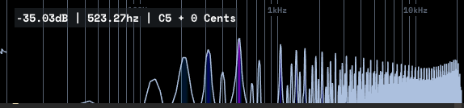

# ewarp
A simple AM/RM and spectrum reverse warp plugin.  

# why
have you heard about prosoniq piwarp or zynaptiq wormhole?I am trying to recreate that warping effect.But this prototype is too far away from that goal now.  

# Features
- build-in DSF oscillator for modulation  
- reverse spectrum
- Only Reverse --> AM --> RM  

# how does it sounds like?
test with saw tooth.  
gabage, really harsh clicks.  

