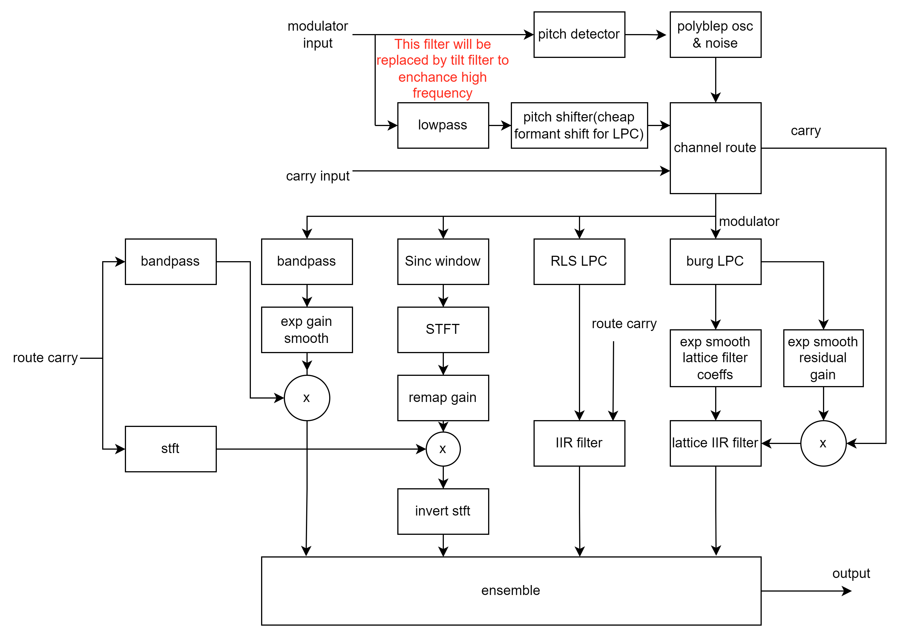

# Green-Vocoder  

Real time music vocoder based on variable methods.  

## signal-flow

## features

**Burg-LPC**: modified leaky add based burg linear prediate vocoder, 0 latency!.  
**RLS-LPC**: recursion least square linear prediate vocoder, better than burg-lpc but takes lot's of cpu  
**STFT-Vocoder**: unique fft Algorithm, from clear to noisy sound.  
**Channel-Vocoder**: bandpass filter classic implemension.  
> [!WARNING]
> The channel vocoder will generate some high volume click when adjust parameters, please pay attention to your sound device and ear!

**Ensemble**: An up to 16-vocices ensemble gives a chrous-like(or unison) sound.  
> [!NOTE]
> This project is still under development.

## GUI(master version)

