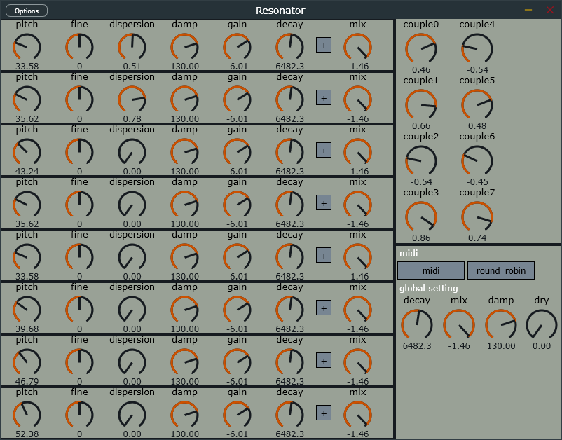

# resonator
resonator is the rework version of [resonator](https://github.com/a5632645/resonator)  
actually it's sounding more like a waveguide instrument  

## signal-flow

## features
inharmonic using allpass filter  
midi control pitch  
couple matrix  

## todo
-[ ]correct delayline pitches  

## gui

