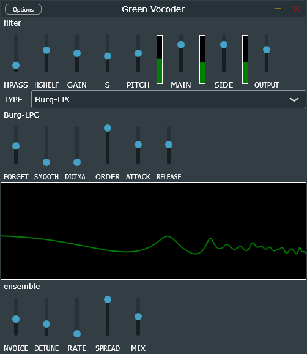

# Green-Vocoder
Real time music vocoder based on variable methods.  
**Burg-LPC**: modified leaky add based burg linear prediate vocoder, 0 latency!.  
**RLS-LPC**: recursion least square linear prediate vocoder, high resonance but cpu heary.  
**STFT-Vocoder**: unique fft Algorithm, from clear to noisy sound.  
**Channel-Vocoder**: bandpass filter classic implemension.  
**Ensemble**: cubic interpolation ensemble gives a chrous-like(or unison) sound.  
> [!NOTE]
> This project is still under development.
# GUI

# Build
```
git clone https://github.com/a5632645/Green-Vocoder.git
git submodule update --init --recursive
mkdir build
cd build
cmake -DCMAKE_BUILD_TYPE=Release ..
cmake --build . --target GreenVocoder_VST3
```