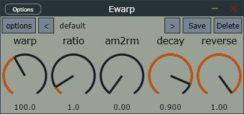
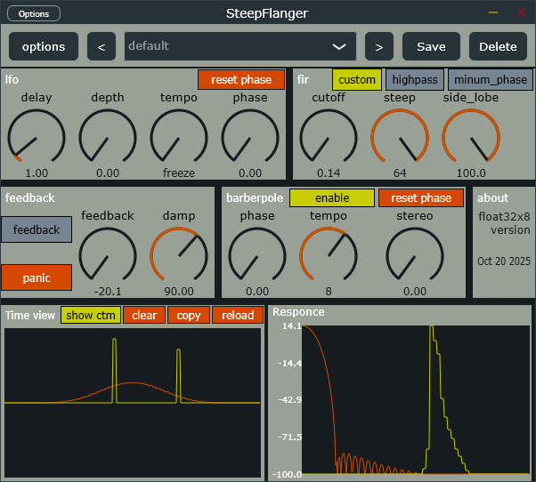
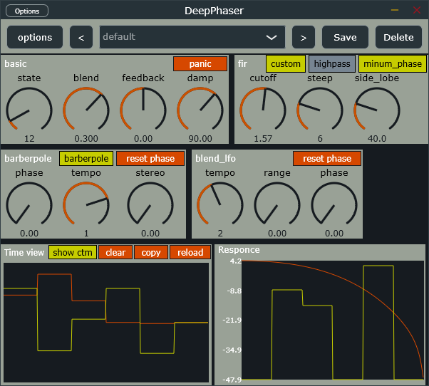
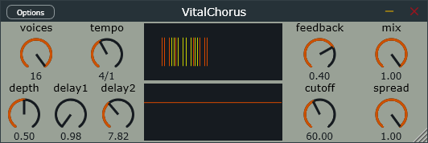

# dev-plugins
originally here lived green vocoder repository.  

## TODO
This repository should be split to multiple project for CI build.  

## list

[ewarp](plugins/ewarp/readme.md) is AM/RM/SpectrumReverse modulator.  

[green-vocoder](plugins/green_vocoder/readme.md) is a multiple algorithms vocoder.
  
---
[steep-flanger](plugins/steep_flanger/readme.md) is a barberpole fir flanger.  

---
[deep-phaser](plugins/deep_phaser/readme.md) is an approximately log-warp style of steep-flanger to create phaser-sounding notches.  

---
[dispersive-delay](plugins/dispersive_delay/readme.md) is a spectal-delay-like delay using tons of cascade allpass filters.(require AVX or AVX2(faster))  

---
[resonator](plugins/resonator/readme.md) is a resonator with allpass dispersion and simple couple matrix.  

---
[vital-chorus](plugins/vital_chorus/readme.md) chours made according to Vital's code.  

---
[vital-reverb](plugins/vital_reverb/readme.md) reverb made according to Vital's code.  

---

## useful links
find more wried plugins at [hirrofox github](https://github.com/hiirofox)  
find more intresting plugins at [ryukau github](https://github.com/ryukau)  
filter for music DSP [THE ART OF VA FILTER DESIGN](https://www.native-instruments.com/fileadmin/ni_media/downloads/pdf/VAFilterDesign_2.1.2.pdf)  

## license
qwqdsp is MIT.  
vital-chorus and vital-reverb are GPLv3, because i reference to vital's code.  
chorus(WIP) is also GPLv3, see [Qdelay](https://github.com/tiagolr/qdelay).  
other plugins are MIT(only the DSP processing part), commercial using need a JUCE commercial license(the hole plugin).  

## credits
preset code from [jucePresetManagement](https://github.com/TheAudioProgrammer/jucePresetManagement)  
great chorus and reverb from [vital](https://github.com/mtytel/vital)
