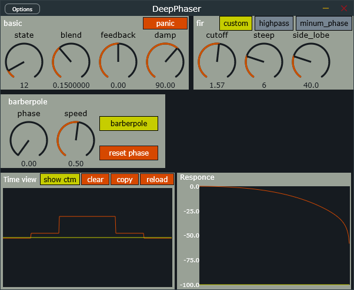
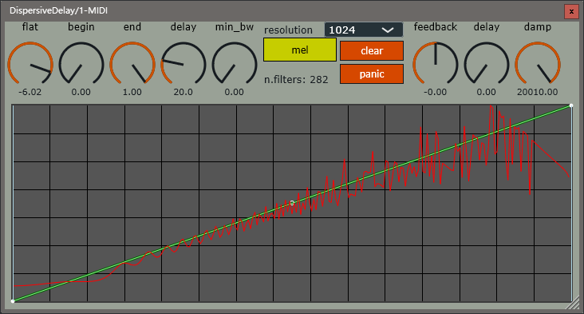
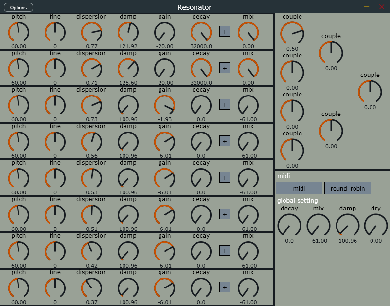
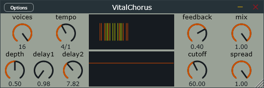
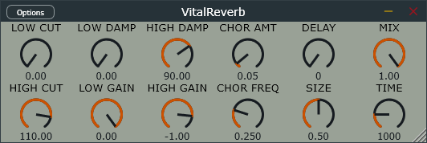

# dev-plugins
originally here lived green vocoder repository.  

[green-vocoder](plugins/green-vocoder/readme.md) is a vocoder with lpc,stft and channel vocoder.  
  
---
[steep-flanger](plugins/steep-flanger/readme.md) is a barberpole fir flanger.  

---
[deep-phaser](plugins/deep-phaser/readme.md) is the son of steep-flanger and dispersive-delay.  

---
[dispersive-delay](plugins/dispersive-delay/readme.md) is a spectal-delay-like delay using tons of cascade allpass filters.(require AVX or AVX2(faster))  

---
[resonator](plugins/resonator/readme.md) is a resonator with allpass dispersion and simple couple matrix.  

---
[vital-chorus](plugins/vital-chorus/readme.md) chours made according to Vital's code.  

---
[vital-reverb](plugins/vital-reverb/readme.md) reverb made according to Vital's code.  

---

## useful links
find more wried plugins at [hirrofox github](https://github.com/hiirofox)  
find more intresting plugins at [ryukau github](https://github.com/ryukau)  
filter for music DSP [THE ART OF VA FILTER DESIGN](https://www.native-instruments.com/fileadmin/ni_media/downloads/pdf/VAFilterDesign_1.1.1.pdf)  
