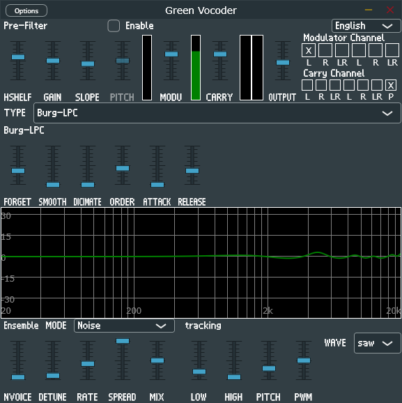

# Green-Vocoder  

Real time music vocoder based on variable methods.  

## features

**Burg-LPC**: modified leaky add based burg linear prediate vocoder, 0 latency!.  
**RLS-LPC**: recursion least square linear prediate vocoder, better than burg-lpc but takes lot's of cpu  
**STFT-Vocoder**: unique fft Algorithm, from clear to noisy sound.  
**Channel-Vocoder**: bandpass filter classic implemension.  
> [!WARNING]
> The channel vocoder will generate some high volume click when adjust parameters, please pay attention to your sound device and ear!

**Ensemble**: An up to 16-vocices ensemble gives a chrous-like(or unison) sound.  
> [!NOTE]
> This project is still under development.

## GUI(master version)



## Build

```bash
git clone https://github.com/a5632645/Green-Vocoder.git
git submodule update --init --recursive
mkdir build
cd build
cmake -DCMAKE_BUILD_TYPE=Release ..
cmake --build . --target GreenVocoder_VST3
```

## PullRequest

I am glad to see someone want to help me develop this plugin.  
